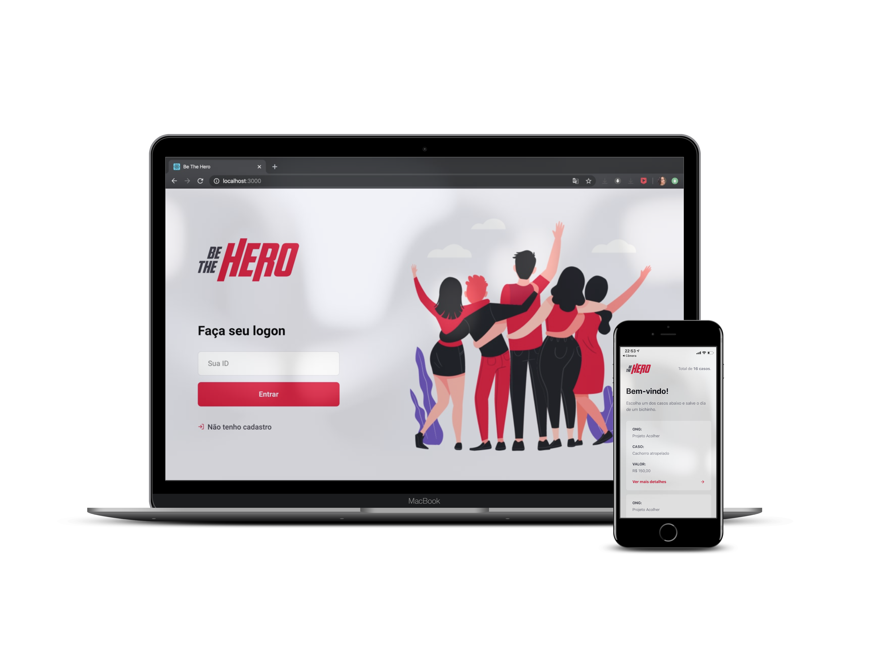

<h1 align="center">
    
</h1>

##  :pushpin:  Projeto

O **Be The Hero** é um projeto que visa conectar pessoas interessadas em ajudar, a ONGs que precisam desta ajuda. 

Possui um aplicativo onde os usuários podem se tornar heróis dos casos disponibilizados e um site destinado as ONGs, para o cadastro dos casos com as descrições, valores e meios de contato para quem tiver interesse em ser o herói.  


Tudo isso utilizando uma única linguagem popular e moderna, o  JavaScript. Produtividade e performance de forma enxuta.


## :rocket:  Tecnologias

No projeto foram utilizadas as seguintes tecnlogias:

- [Node.js](https://nodejs.org/en/) 

- [React](https://reactjs.org) 

- [React Native](https://facebook.github.io/react-native/) 

- [Expo](https://expo.io/) 

- [SQLite](https://www.sqlite.org/index.html) 


Softwares:

- [VSCode](https://code.visualstudio.com/)

- [Insomnia REST Client](https://insomnia.rest/)

## :art:  Layout



## :computer:  Instalação

O **Backend** foi construido em **NodeJS**.

Iniciando o backend: <br>

```bash

cd backend

npm install

npm start

```
O **Frontend** foi construido em **React**.

Iniciando o Frontend: <br>

```bash

cd frontend

npm install

npm start

```  
O **Mobile** foi construido em **React Native**.

Iniciando o Mobile: <br>

```bash

npm install -g expo-cli

cd mobile

npm install

expo start

```

Rode ```npm start``` nas pastas backend e mobile, acesse **localhost:19002**, leia o QR Code no seu celular e utilize o aplicativo Expo para rodar a versão mobile no seu smartphone. Voce pode baixá-lo na Play Store ou App Store.


